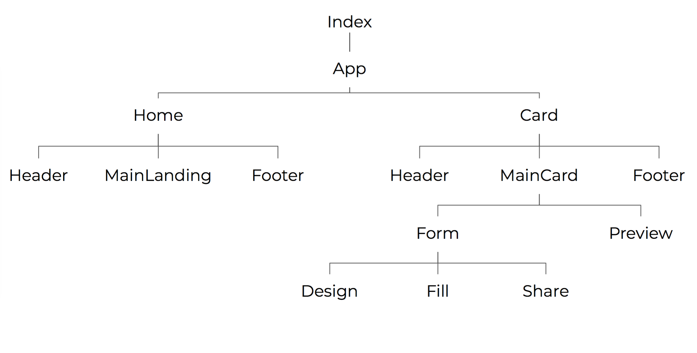

# We are React-it-Ralph!

Welcome to Awesome Profile Cards - on our interactive SPA (Single Page Application) you can create your own digital business card and share the link.

## More information

This project was completed in React using create-react-app. The styles were created using SCSS files  (converted into CSS with a preprocessor).

We 'inherited' code from a previous project which we were asked to use to create ours.

## Project structure

```
React-it-Ralph
├── .gitignore
├── package.json
├── package-lock.json
├── public
│   └── index.html
└── src
    ├── components
    │   ├── card
    │   │   ├── Card.js
    │   │   ├── Collapsable.js
    │   │   ├── defaultImage.js
    │   │   ├── Design.js
    │   │   ├── Fill.js
    │   │   ├── Form.js
    │   │   ├── GetAvatar.js
    │   │   ├── HeaderCard.js
    │   │   ├── MainCard.js
    │   │   ├── Preview.js
    │   │   ├── Share.js
    │   │   └── Twitter.js
    │   ├── home
    │   │   ├── Header.js
    │   │   ├── Home.js
    │   │   └── MainLanding.js
    │   ├── App.js
    │   └── Footer.js
    ├── images
    ├── services
    │   └── SendPetition.js
    ├── stylesheets
    │   ├── core
    │   │   ├── functions.js
    │   │   ├── mixins.js
    │   │   ├── settings.js
    │   │   └── variables.js
    │   ├── layout
    │   │   ├── footer.js
    │   │   ├── forms.js
    │   │   ├── header.js
    │   │   ├── landing.js
    │   │   ├── preview.js
    │   │   └── structure.js
    │   └── index.scss
    ├── App.js
    └── index.js
```

## Component structure



## Authors

* [Angelica Cavero](https://github.com/nagema)
* [Megan Edwards](https://github.com/m-m-e)
* [Patricia Garcia Fernandez](https://github.com/patijoe)
* [Iris Paredes](https://github.com/irisparedes)
* [Marta Sobrino](https://github.com/martasobrino)

## Contribute

If you have any ideas or suggestions, let us know! Feel free to send us a pull request or add an issue.

React-it-Ralph ©2019